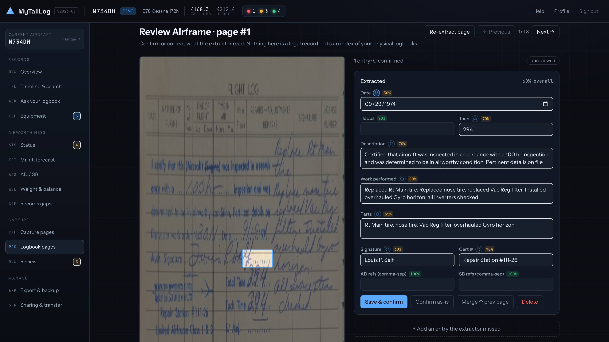
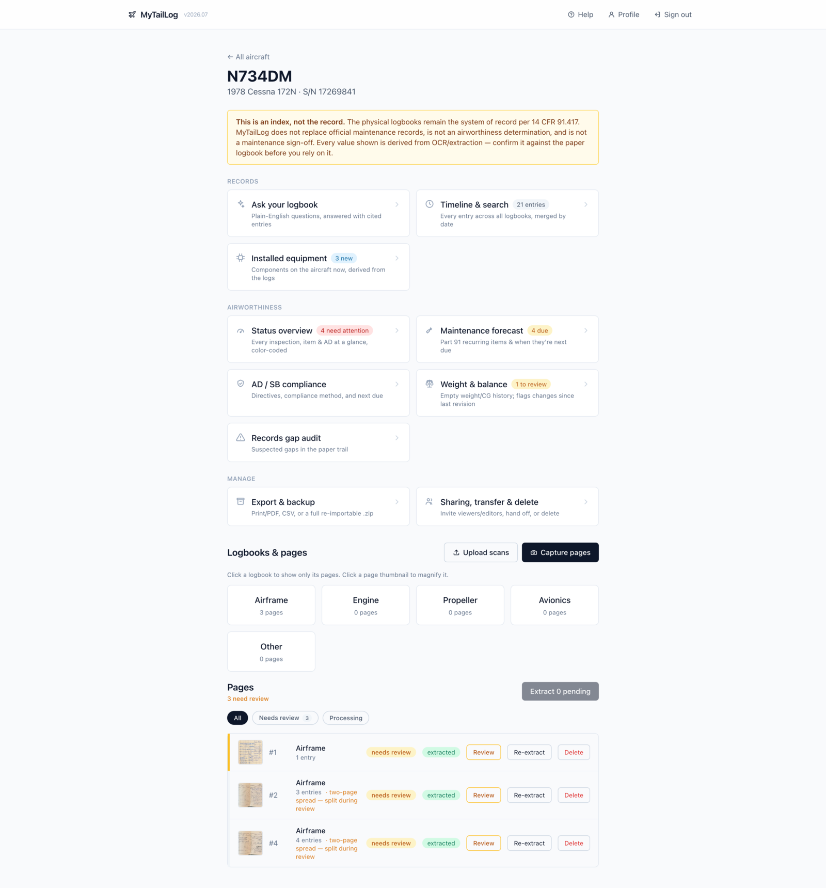
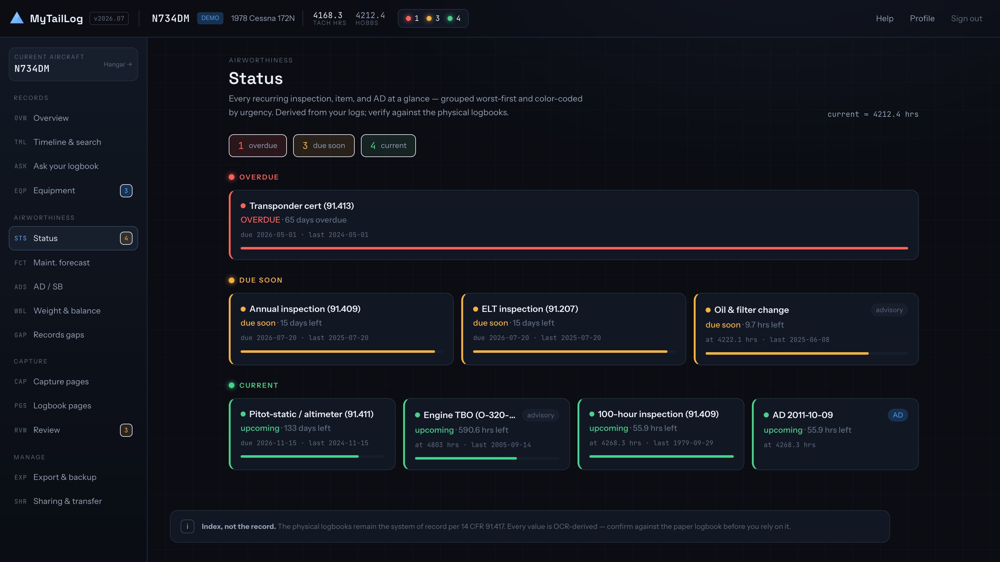
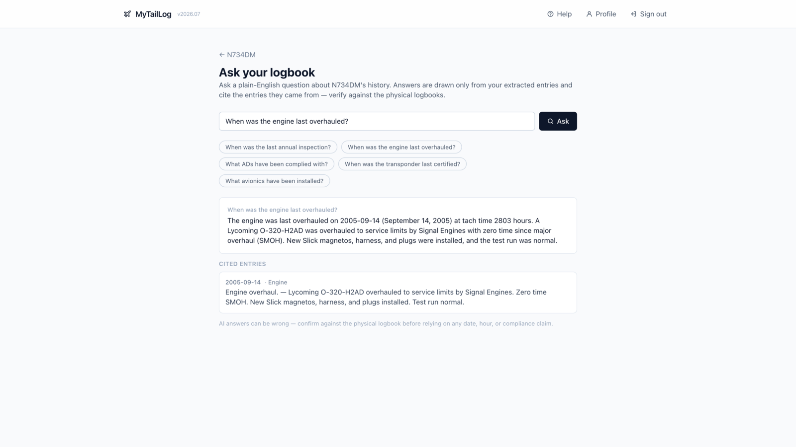
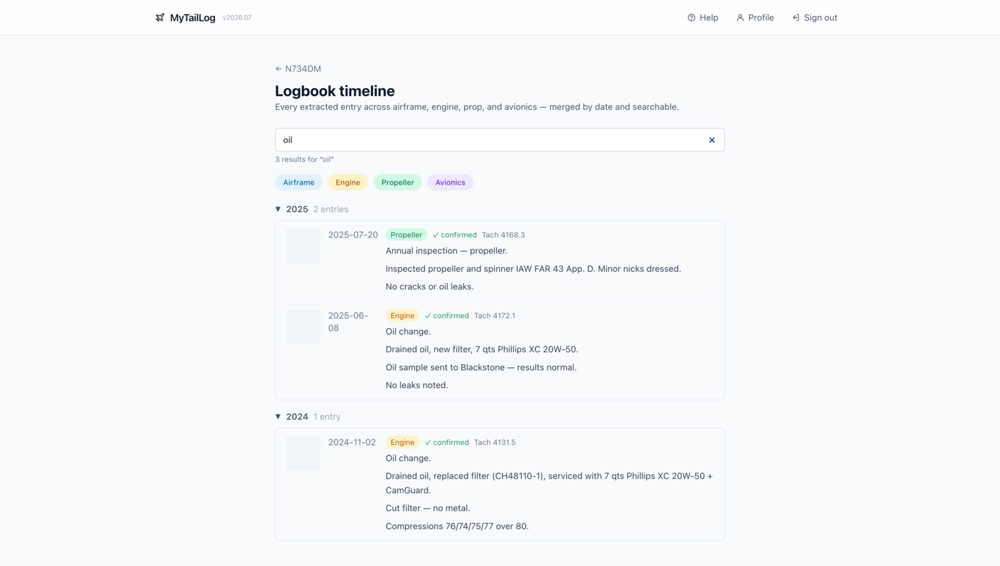
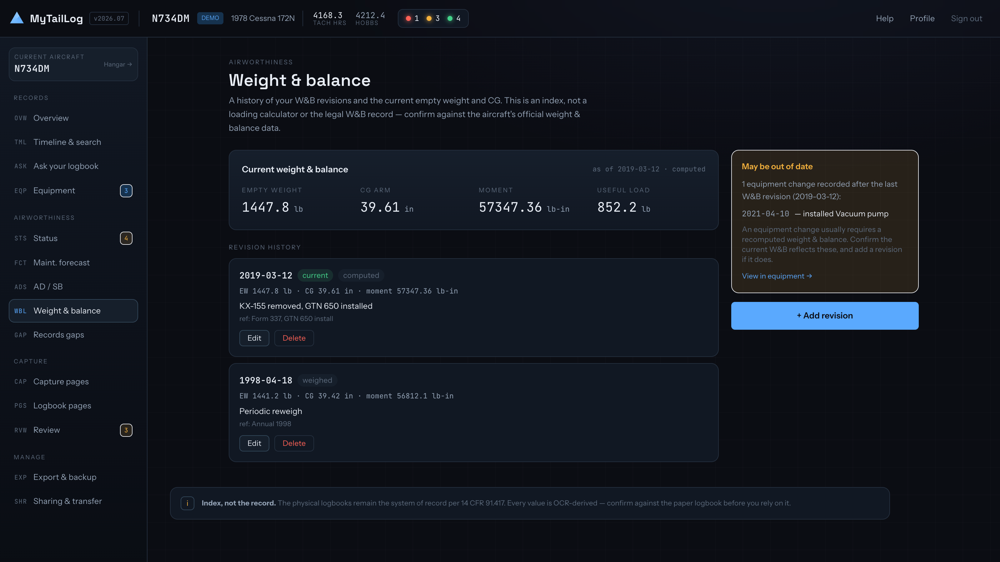

# MyTailLog

Aircraft logbook digitization & maintenance tracker for piston GA owners — live at **[mytaillog.com](https://mytaillog.com)**.

> **This tool is an index and decision-support layer, not the legal record.**
> The physical logbooks remain the system of record per **14 CFR 91.417**.
> MyTailLog does not replace official maintenance records, does not constitute
> an airworthiness determination, and is not a maintenance sign-off. Every
> value it shows is derived from AI extraction or data you entered, and must be
> confirmed against the physical logbook before you rely on it.

## What it is

MyTailLog turns decades of paper airframe / engine / prop / avionics logbooks
into a **searchable, gap-auditable, compliance-forecasting index** — sized for a
single piston GA owner (and the people they share a plane with), not a fleet. You
photograph or upload your logbook pages, AI reads them into structured entries,
and the app tracks inspections, ADs, equipment, weight & balance, and flight
hours — then reminds you before things come due.

## Screenshots

AI reads the page; you review it next to the original, with low-confidence fields flagged
*(all shots are the demo aircraft — a fictional 1978 C172N every new account gets):*



<details>
<summary><b>More screenshots</b> — aircraft overview · Status grid · Ask your logbook · Timeline · Weight &amp; Balance</summary>

<br>

**Aircraft overview** — everything at a glance, color-coded by what needs attention


**Status** — every inspection, item, and AD by urgency (with email reminders before they come due)


**Ask your logbook** — plain-English answers that cite their source entries


**Timeline & search** across all logbooks


**Weight & Balance** — revision history + current empty weight/CG


</details>

## Features

**Capture → extract → review**
- Camera capture with automatic document edge-detection / deskew / crop, or
  upload scans (PDF / JPEG / PNG). Offline-friendly: pages queue on-device and
  upload when back online.
- Vision-LLM extraction into structured entries (date, hours, work, parts,
  AD/SB refs, signature) with **per-field confidence**; a review screen shows the
  page image beside editable entries and flags low-confidence fields.
- Five logbook types — airframe, engine, prop, avionics, and **Other**.
- **Find duplicates** — flags likely-duplicate scans and entries (by date,
  tach/hobbs, and work text) so re-captures and re-extractions don't pile up.

**"Other" A&P documents (auto-applied)**
- Scan a **Weight & Balance sheet** → it creates a new W&B revision.
- Scan an **AD compliance report** → it becomes the ground truth for your AD
  state, corroborates matching tracked ADs (with a "✓ A&P report" badge), and
  adds any it lists that you weren't tracking.

**Engine health**
- **Oil analysis** — import a lab report (Blackstone, AVLab, …) as a PDF or a
  photo; AI reads every sample in it (wear metals in ppm, oil properties, the
  lab's written comments), and each metal is charted over time against the lab's
  universal average — above it is flagged. Re-importing a report updates in place.

**Understand & forecast**
- **Ask your logbook** — plain-English questions answered from your entries, with
  the source entries cited.
- **Timeline & search** across all logbooks; **Status** grid (color-coded, at a
  glance); **Maintenance forecast** (Part 91 recurring items, hours- and
  date-based); **AD/SB compliance** with official FAA reference lookup (Federal
  Register + DRS fallback); **Installed equipment** reconstructed from the logs;
  **Weight & Balance** history with a stale-since-last-equipment-change flag;
  **Records gap audit**.

**Flight hours & reminders**
- **MyFlightBook integration** (per-user OAuth) pulls your latest hobbs/tach so
  the forecast reflects real hours.
- A **daily job** auto-syncs hours (once/day) and emails **reminders** before due
  items — annual, oil, ADs, and more, each with a configurable lead time.

**AI keys & cost control**
- Extraction and Q&A run on the app's shared Anthropic key by default, bounded by
  a **per-user daily call cap** and a **global daily-$ ceiling** (both env-tunable).
- Owners can **bring their own Anthropic API key** (stored encrypted) to bill AI
  usage to their own account and get a much higher limit; the Profile page shows
  their calls, tokens, and estimated cost so far.

**Own your data**
- Print/PDF and CSV exports, plus a full **`.zip` backup** (records + scans) you
  can **re-import**.
- **Sharing** (viewer / contributor), **ownership transfer**, and delete.
- In-app **Help** documenting every feature and how the pieces affect each other.

## Architecture

- **Next.js 15 (App Router) + TypeScript + Tailwind** — server components, server
  actions, and route handlers in one deployable unit; a capture PWA (service
  worker + IndexedDB queue) for offline capture.
- **Supabase** — Postgres + Auth + object Storage. **Row-level security is the
  enforcement boundary**, funneled through a single `has_aircraft_access()` /
  `can_edit_aircraft()` choke point; every table and storage object is scoped to
  the users who own or are shared on the aircraft.
- **Anthropic** — a strong vision model (`claude-opus-4-8`) for handwriting/image
  extraction (`EXTRACTION_MODEL`), and a cheap text model (`claude-haiku-4-5`) for
  text-only reasoning — Q&A, equipment/maintenance detection (`TEXT_MODEL`). Every
  AI route funnels through one gate (`prepareAi`) that resolves the caller's key
  (shared or their own), enforces the caps, and meters usage into a
  **server-authored** `ai_usage` ledger (written only by the service role, so the
  budget guard can't be forged). The per-request key is carried via
  `AsyncLocalStorage`, so no call site needs a key parameter.
- **Secrets encrypted at rest** — third-party credentials (MyFlightBook OAuth
  client secret + tokens) and each user's own Anthropic key are AES-256-GCM
  encrypted (`src/lib/crypto.ts`, `ENCRYPTION_KEY`); RLS isolates them, encryption
  defends against a backup/replica leak. Decryption is server-only; nothing
  sensitive is read back to the browser.
- **Defense-in-depth headers** — global CSP, `X-Frame-Options: DENY`, HSTS,
  `nosniff`, Referrer/Permissions policies; the public origin is pinned to
  `NEXT_PUBLIC_SITE_URL` rather than reflected from a request header.
- **All image processing is browser-side** (thumbnails, PDF rasterization, zip
  build/read) — the server never touches image bytes, keeping hosting at ~zero
  marginal cost.
- **Firebase App Hosting** (Cloud Run) for the app, **Cloud Scheduler** for the
  daily job, and **Resend** for reminder email.
- **FAA data** comes from the **Federal Register API** (source of truth for
  post-1994 ADs — `src/lib/faa/federalRegister.ts`) with a reverse-engineered
  **DRS fallback** for legacy ADs (`src/lib/faa/drs.ts`). Access model:
  - The **Federal Register** fetch runs **client-side, in the browser**. GPO's
    origin nginx IP-blocks Cloud Run's datacenter egress with a bare `403
    Forbidden` (works from a laptop, fails in prod). The FR API is CORS-enabled
    (`access-control-allow-origin: *`) and our client is isomorphic, so it runs
    from the user's residential IP. Server actions only supply DB inputs
    (`getExploreTargets`) and persist results (`saveAdReference`,
    `trackCandidate`); the module's `user-agent` header is gated to server calls
    (browsers forbid setting it).
  - **DRS** runs **server-side** (`enrichViaDRS`) — `drs.faa.gov` does *not*
    block our egress, and it needs a minted session cookie + browser-like UA
    (see the client header comment). It's a best-effort scraper, not an API.

Data model (Postgres, migrations `supabase/migrations/00*`): `aircraft` →
`logbook` → `page` → `log_entry`, plus `ad_compliance` / `ad_reference`,
`component` / `equipment_proposal`, `maintenance_item`, `weight_balance`,
`scanned_document`, `document`, `oil_analysis_sample`, `aircraft_share`,
`mfb_connection` / `hours_reading`, `reminder_log`, `ai_usage` / `user_ai_key`,
and `profile`.

## Costs

Targets **~zero marginal cost**: Firebase App Hosting (scale-to-zero) and Supabase
free tiers cover a personal deployment, and all image work is client-side. The
one metered line item is **LLM calls** — bounded (cents per page for the one-time
backlog, then a trickle) and split so the cheap model does the high-volume text
work. The operator sets an `ANTHROPIC_API_KEY`; usage on it is capped **per user
per day** (`AI_SHARED_USER_DAILY_CALLS`) and by a **global daily-$ ceiling**
(`AI_SHARED_DAILY_USD`). Any user can also **bring their own key** to bill their
own account and lift the limit.

## Getting started (local)

```bash
npm install
cp .env.example .env.local     # fill in Supabase URL + anon key, ANTHROPIC_API_KEY, etc.
# Apply supabase/migrations/*.sql in order via the Supabase dashboard SQL editor
npm run dev                    # http://localhost:3000
```

See [`.env.example`](./.env.example) for all config (required vs optional) and
[`supabase/README.md`](./supabase/README.md) for the schema + RLS model.

## Deploy (Firebase App Hosting + Supabase)

MyTailLog runs as a Next.js server on **Firebase App Hosting** (Cloud Run, builds
on every GitHub push, global CDN) over a **Supabase** project. Config is in
[`apphosting.yaml`](./apphosting.yaml).

**Prerequisites:** a Firebase project on the **Blaze** plan (App Hosting requires
it; metered but ~$0 at personal scale — set a budget alert) and the Firebase CLI.

**1. Secrets** (Cloud Secret Manager, referenced by name in `apphosting.yaml`):
```bash
firebase apphosting:secrets:set NEXT_PUBLIC_SUPABASE_URL
firebase apphosting:secrets:set NEXT_PUBLIC_SUPABASE_ANON_KEY
firebase apphosting:secrets:set ANTHROPIC_API_KEY
firebase apphosting:secrets:set ENCRYPTION_KEY        # AES key for at-rest secret encryption; `openssl rand -base64 32`
firebase apphosting:secrets:set SUPABASE_SECRET_KEY   # Supabase → API Keys → "Create secret key" (also writes the ai_usage ledger)
# For the daily reminder/sync cron (optional but recommended):
firebase apphosting:secrets:set RESEND_API_KEY        # for reminder email
firebase apphosting:secrets:set CRON_SECRET           # random string; gates the cron endpoint
```

Non-secret config in [`apphosting.yaml`](./apphosting.yaml): `NEXT_PUBLIC_SITE_URL`
(pins the public origin), `EXTRACTION_MODEL` / `TEXT_MODEL`, and the AI cost caps
(`AI_SHARED_USER_DAILY_CALLS`, `AI_OWN_USER_DAILY_CALLS`, `AI_SHARED_DAILY_USD`).
**`ENCRYPTION_KEY` must match between prod and any local `.env.local` that shares
the same database** — a value encrypted under one key can't be decrypted under
another.

**2. Backend** — Firebase console → **App Hosting → Get started** → connect the
GitHub repo + `main` branch. Every push to `main` builds and rolls out.
(`apphosting.yaml` sets scale-to-zero, `maxInstances: 2`, 1 vCPU / 1 GiB.)

**3. Supabase auth URLs** (fixes magic links landing on `localhost`):
Supabase → **Authentication → URL Configuration** → **Site URL**
`https://mytaillog.com`, **Redirect URLs** `https://mytaillog.com/auth/callback`.
Configure custom SMTP (e.g. Resend) to lift the built-in email rate limit.

**4. Custom domain** — App Hosting → **Add custom domain** → add the DNS records;
Google provisions a managed TLS cert.

**5. Migrations** — run `supabase/migrations/*.sql` **in order** via the dashboard
SQL editor (the repo isn't CLI-linked). Enum-adding migrations (e.g.
`0004`/`0017`) must be run and committed **before** the migration that uses the
new value.

**6. Daily reminders (optional)** — create a **Cloud Scheduler** job that does a
daily `POST https://mytaillog.com/api/cron/daily` with header
`Authorization: Bearer <CRON_SECRET>`.

### Cost & known ceilings
- **App Hosting / Cloud Run:** scale-to-zero → ~$0 idle; Cloud Run free tier
  covers personal traffic. Blaze has no hard cap — set a budget alert.
- **Request timeout:** Cloud Run default 300s covers extraction and full-history
  scans (`maxDuration` in the routes is a Vercel-only hint, ignored here).
- **Supabase free:** 1 GB storage (scans), 500 MB DB, pauses after 7 days idle,
  no automatic backups (use the in-app `.zip` export, or Supabase Pro).

The app also deploys to **Vercel** (Hobby caps functions at 60s and is
non-commercial); Cloud Run avoids both.

## Data isolation & privacy

Every record belongs to the users who own or are shared on its aircraft, enforced
by Postgres row-level security — not just app code. Aircraft records (tail
numbers, serials, owner names, home base) are treated as **sensitive personal
data**. Sharing is by email with viewer/contributor roles. Per-user secrets
(MyFlightBook OAuth client secret + tokens, and a user's own Anthropic key) are
**encrypted at rest** (AES-256-GCM) and only ever decrypted server-side — never
sent to the browser. Responses carry defense-in-depth security headers (CSP,
frame/HSTS/nosniff), and redirect origins are pinned to a configured value rather
than a request header. The elevated (RLS-bypassing) code paths — the daily cron
and the `ai_usage` ledger write — use a Supabase secret API key: the cron is
scoped to its endpoint behind a shared-secret gate, and the ledger write exists
so the shared-key cost guard can't be forged by a client.

## Explicitly out of scope

eSignatures (keeps us in "index of the physical record" territory, avoiding
AC 120-78A), parts procurement/inventory, work orders, flight scheduling, and MRO
multi-fleet management.

## License

[MIT](./LICENSE)
